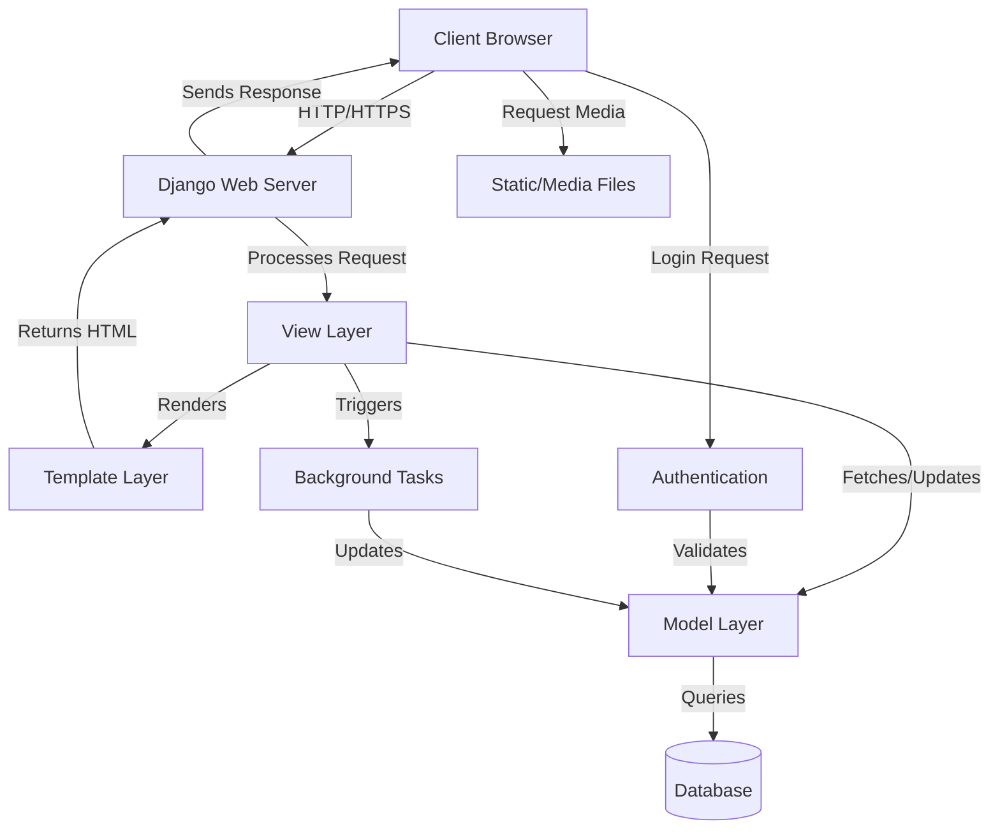
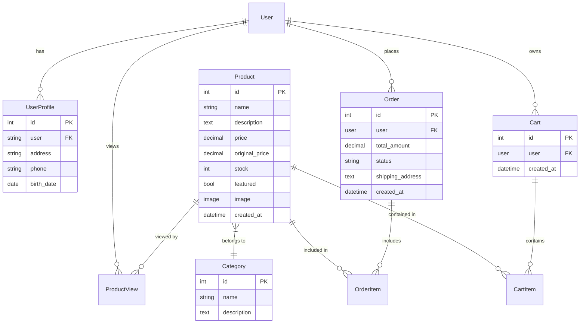
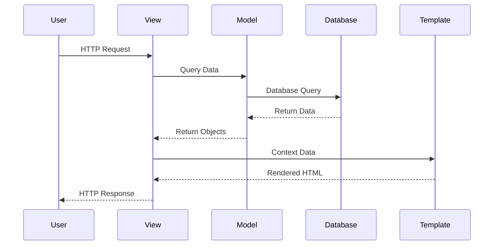
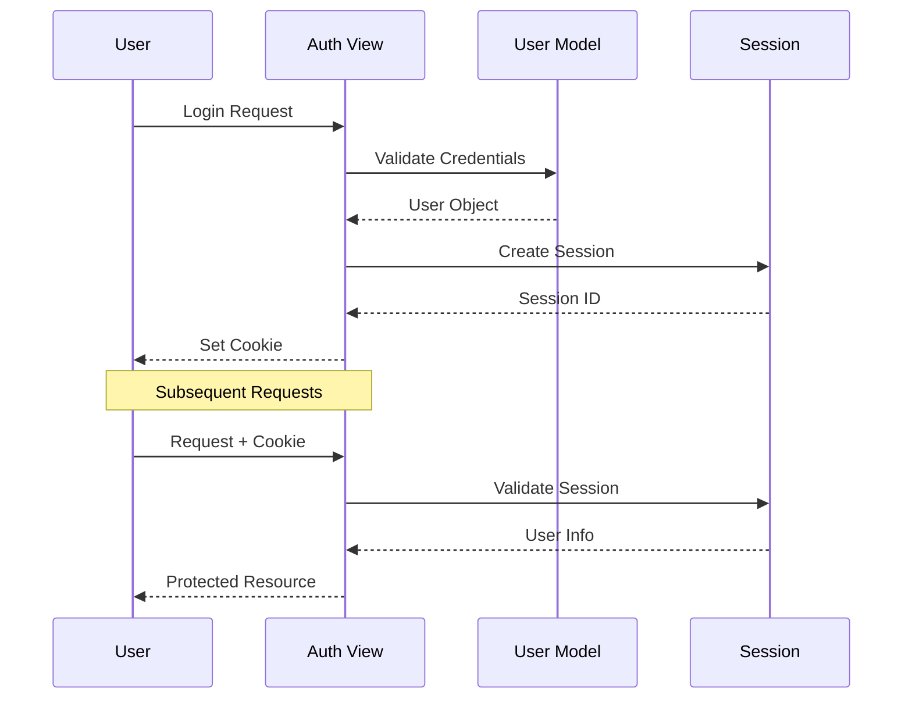
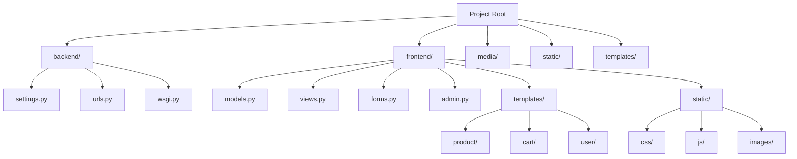
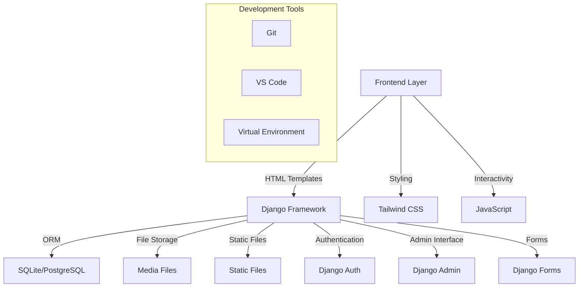

# Smart Shop - Modern E-commerce Platform

A feature-rich e-commerce platform built with Django and modern web technologies. This project implements a complete shopping experience with product management, cart functionality, user authentication, and more.

## 🌟 Features

### Product Management
- Product catalog with categories
- Product search and filtering
- Product recommendations
- Featured products showcase
- Product details with images
- Price tracking (original vs. current price)
- Stock management

### Shopping Experience
- Shopping cart functionality
- Add/remove items from cart
- Update quantities in cart
- Persistent cart for logged-in users
- Guest shopping cart
- Product recommendations
  - Similar products
  - Frequently bought together
  - Personalized recommendations

### User Management
- User registration and authentication
- User profiles
- Order history
- Viewing history
- Default shipping address
- Password reset functionality

### Admin Features
- Django admin interface
- Product management
- Category management
- Order management
- User management
- Stock tracking

## 🚀 Getting Started

### Prerequisites
- Python 3.8 or higher
- pip (Python package manager)
- Virtual environment (recommended)

### Installation

1. Clone the repository:
```bash
cd smart-shop
```

2. Create and activate a virtual environment:
```bash
python -m venv venv
source venv/bin/activate  # On Windows: venv\Scripts\activate
```

3. Install dependencies:
```bash
pip install -r requirements.txt
```

4. Apply database migrations:
```bash
python manage.py migrate
```

5. Create a superuser:
```bash
python manage.py createsuperuser
```

6. Load sample data (optional):
```bash
python manage.py create_test_data
```

7. Run the development server:
```bash
python manage.py runserver
```

Visit http://127.0.0.1:8000/ to see the application.

## 🏗 Architecture

### System Architecture



### Database Schema



### Component Interaction



### Authentication Flow



### Directory Structure



### Technology Stack



## 📁 Project Structure

```
smart-shop/
├── backend/              # Project settings and main URLs
├── frontend/            # Main application
│   ├── management/     # Custom management commands
│   ├── migrations/    # Database migrations
│   ├── static/       # Static files (CSS, JS, images)
│   ├── templates/   # HTML templates
│   ├── models.py   # Database models
│   ├── views.py   # View logic
│   ├── urls.py   # URL routing
│   └── forms.py  # Form definitions
├── media/        # User-uploaded files
├── static/      # Collected static files
└── templates/  # Project-wide templates
```

## 🔧 Key Components

### Models
- `Category`: Product categories
- `Product`: Product information and metadata
- `Cart`: Shopping cart
- `CartItem`: Items in cart
- `Order`: Order information
- `ProductView`: Product viewing history
- `UserProfile`: Extended user information

### Views
- Product listing and detail views
- Cart management views
- User authentication views
- Profile management
- Order processing

### Templates
- Base template with common layout
- Product templates
- Cart templates
- User account templates
- Order templates

## 🛠️ Technologies Used

- **Backend**: Django 5.0
- **Database**: SQLite (default), can be configured for PostgreSQL
- **Frontend**: 
  - HTML5
  - Tailwind CSS
  - JavaScript
- **Image Handling**: Pillow
- **Version Control**: Git

## 🔒 Security Features

- CSRF protection
- Password hashing
- Session management
- Secure form handling
- XSS protection
- SQL injection protection

## 🎨 Styling

The project uses Tailwind CSS for styling with:
- Responsive design
- Dark mode support
- Modern UI components
- Custom animations
- Gradient effects

## 📱 Responsive Design

The application is fully responsive and works on:
- Desktop computers
- Tablets
- Mobile phones

## 🚦 Testing

Run the tests with:
```bash
python manage.py test
```

## 📝 License

This project is licensed under the MIT License - see the LICENSE file for details.

## 🤝 Contributing

1. Fork the repository
2. Create your feature branch
3. Commit your changes
4. Push to the branch
5. Create a new Pull Request

## 📞 Support

For support, email support@example.com or create an issue in the repository.

## 🙏 Acknowledgments

- Django documentation
- Tailwind CSS team
- The open-source community

## 🔄 Future Updates

- [ ] Payment gateway integration
- [ ] Email notifications
- [ ] Advanced search features
- [ ] Product reviews and ratings
- [ ] Wishlist functionality
- [ ] Multiple language support
- [ ] Social media integration
- [ ] API endpoints for mobile apps
